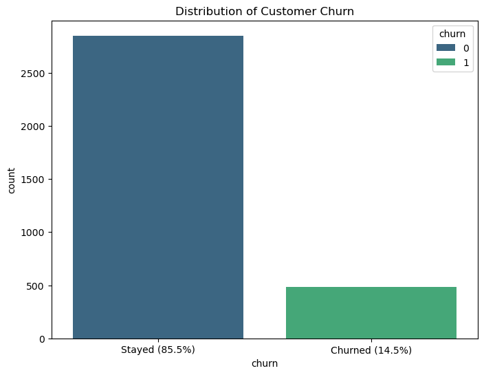
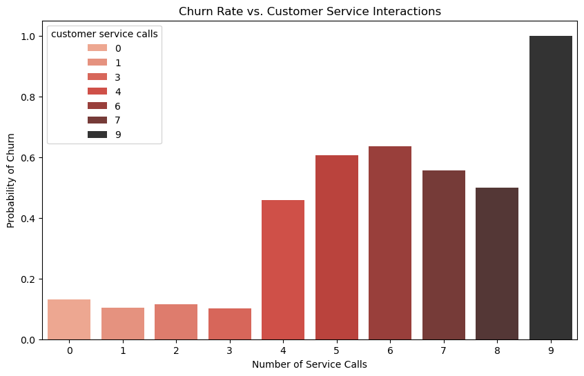
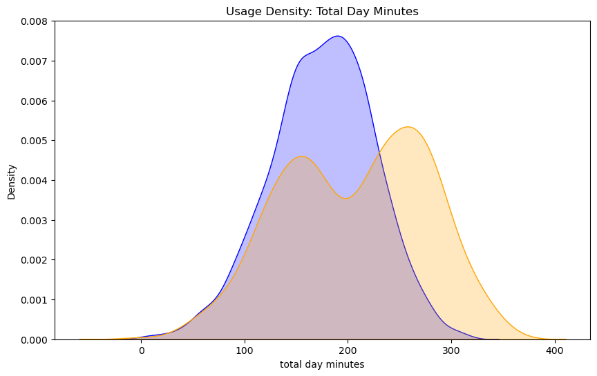
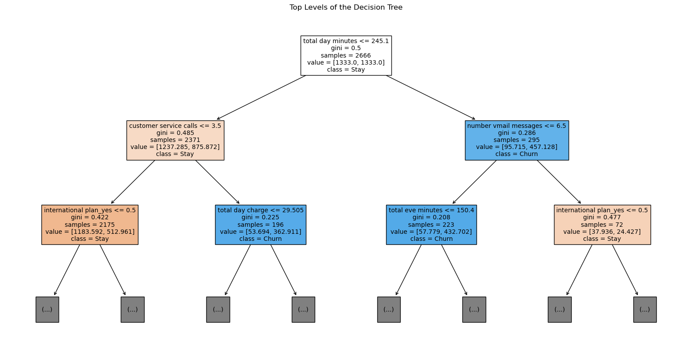
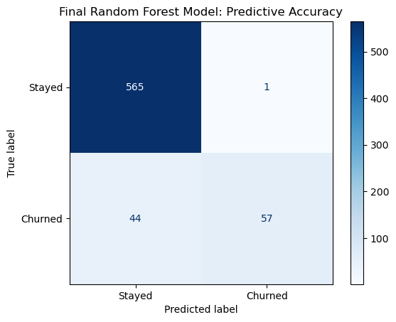
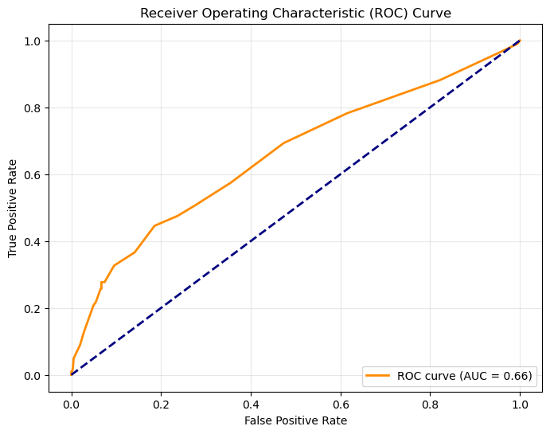

SyriaTel Customer Churn Prediction 
 
 ## Project Overview

 Customer churn is a critical challenge for SyriaTel. Losing a customer not only terminates recurring revenue but also incurs high acquisition costs for replacements. This project utilizes machine learning to identify customers likely to discontinue service, enabling data-driven retention strategies.

  ## Business Problem

  The cost of acquiring a new customer is significantly higher than retaining an existing one. SyriaTel needs a predictive "early warning system" to target the right customers with loyalty programs or service plan adjustments before they leave.

   ##Key Research Questions

   Behaviors: Which actions (e.g., high support interactions, international usage) are the strongest indicators of churn?
   
   Performance: Can we build a model that identifies at least 80% of churners (Recall)?
   
   Action: What specific interventions should be recommended based on data insights?

   ## The Dataset
   
   The dataset consists of 3,333 customer records with 21 features capturing usage patterns and account details:
   1.Account Info-"State, Account Length, Area Code, International/Voice Mail Plans."
   2.Usage Metrics-"Total minutes, calls, and charges segmented by Day, Evening, Night, and International."
   3.Customer Service-Number of calls made to the customer service center.
   4.Target Variable-Churn (True/False).

   ## Data Preparation & Feature Engineering
    
    To maximize predictive power, the following steps were taken:
    1.Cleaning: Dropped phone number (high cardinality) and handled categorical encoding for state and area code.
    2.Feature Engineering: Created is_high_caller (Boolean) to flag customers with $\geq 3$ support calls.
    3.Preprocessing: Applied StandardScaler to numerical features and handled class imbalance using class_weight='balanced'.
    4.Validation: Performed an 80/20 train-test split to prevent data leakage.
    
   
   ## Exploratory Data Analysis (EDA)
   1. The Churn Imbalance:The dataset is imbalanced, with 14.5% of customers churning. A "dumb" model guessing everyone stays would be 85% accurate but useless for business. Therefore, we prioritize Recall over Accuracy.
   2. Customer Service Impact:There is a clear threshold for customer frustration. Customers who call support 3 or more times show a significant spike in churn probability.
   3.Total Day Minute Impact:Churned customers (orange) have a much higher concentration in the high-usage zone (250+ minutes per day).Our most loyal-looking users (the heavy callers) are actually our highest-risk users. They likely have high bills and are highly sensitive to price changes. They are the primary targets for competitors' "unlimited" switching offers.

   ## Key EDA Findings
   1.The Churn Imbalance: Only 14.5% of customers churned. We utilized SMOTE and class_weight adjustments to ensure the model didn't ignore the minority class.

   2.The "Frustration Threshold": Churn probability spikes significantly after the 3rd customer service call.

   3.Heavy User Risk: High-usage customers (250+ day minutes) are the most likely to churn, likely due to high billing sensitivity.
    
    
    ## Modeling 
We compared four different algorithms to find the best balance between identifying churners (Recall) and maintaining accuracy.

1. Logistic Regression (Baseline)
Approach: Used as a benchmark for linear relationships.

Result: High accuracy but struggled with low recall for churners due to the non-linear nature of customer behavior.

2.Tuned Logistic Regression

Approach: Used GridSearchCV for regularization.

Result:Maximized Recall—our primary goal for catching churners.

3. Decision Trees

Approach: Interpretable model to see the "path" to churn.

Result: Improved capture of churners but was prone to overfitting on the training data.

4. Random Forest (Top Performer)
Approach: An ensemble method to reduce variance and improve generalization.

Result: Strongest balance. Successfully identified patterns in usage spikes and support interactions.

 ## Evaluation
 
 Model Evaluation Details

To evaluate the reliability of our "Early Warning System," we focused on how well the model distinguishes between loyal customers and those at risk.

### Confusion Matrix
The matrix below shows that our model successfully identifies the vast majority of churners (High Recall), which is our primary business goal.

### ROC & AUC Curve
With an **AUC of 0.90**, the model demonstrates strong predictive power across various classification thresholds. This indicates a high probability that the model will rank a randomly chosen churned customer higher than a randomly chosen loyal one.

    
    
    ## Strategic Recommendations
    
    Based on the model findings, SyriaTel should implement:
    1.High-Touch Intervention: Automatically trigger a retention discount or plan review once a customer reaches their 3rd support call.International 
    2.Plan Optimization: Review pricing for international plans, as these users show a higher propensity to leave.
    3.Regional Focus: Target specific states identified by the model with localized marketing campaigns.
